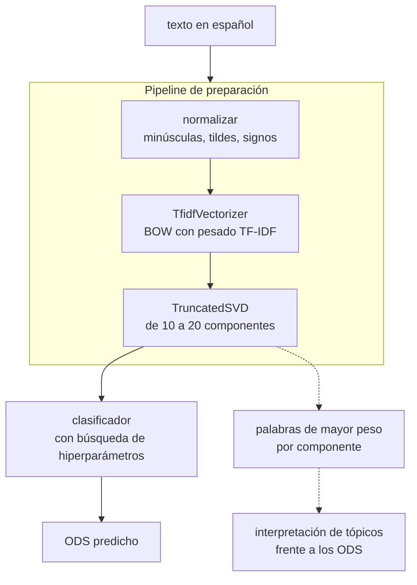

# Clasificación de textos según los Objetivos de Desarrollo Sostenible

Solución de procesamiento de lenguaje natural que toma un texto en español y lo relaciona con
uno de los Objetivos de Desarrollo Sostenible de la Agenda 2030. El corpus son párrafos
etiquetados por voluntarios del proyecto OSDG, traducidos al español y aumentados. El método
representa cada documento con TF-IDF, lo proyecta a un espacio de pocas dimensiones con SVD
truncado, que a la vez sirve de modelo de tópicos (LSA), y clasifica sobre esa representación.

> Micro proyecto 2 del curso ML No Supervisado, Universidad de los Andes (bimestre 2026-14).
> Autores: Juan David Lara Camacho, Miguel. Entrega: domingo 20 de septiembre de 2026.



La misma descomposición cumple dos papeles que el enunciado califica por separado: es el modelo
de tópicos del 15% y es la reducción de dimensionalidad que exige el 30% del modelo. El
enunciado lo autoriza de forma explícita.

## El entregable

El entregable son dos archivos, `notebooks/Microproyecto_2.ipynb` y su versión en HTML, y el
calificador no recibe este repositorio: el resto es andamiaje. La rúbrica completa está en
[`Enunciado.md`](Enunciado.md), que además trae las **notas de lectura**: lo que el corpus tiene
de verdad y los puntos de la rúbrica que se pierden por olvido.

| Actividad | Peso |
|---|---|
| Preparación de los datos, con la reducción de dimensionalidad justificada | 30% |
| Pipeline de preparación | 15% |
| Clasificador con búsqueda de hiperparámetros y métricas justificadas | 30% |
| Clasificación de al menos cuatro textos no vistos | 10% |
| LSA sobre TF-IDF e interpretación de al menos 5 tópicos | 15% |
| *Opcional:* aplicación en Streamlit | *+15 puntos* |

## Los datos

`data/Train_textosODS.xlsx`, descargado de Coursera. **9.656 textos y dos columnas**, `textos` y
`ODS`, sin nulos ni duplicados exactos. Tres hechos que condicionan el diseño y que el enunciado
no menciona:

- **Son 16 clases, no 17.** El ODS 17 no aparece en el archivo.
- **Desbalance de 3,5 a 1**, entre el ODS 16 con 1.080 textos y el ODS 12 con 312. La exactitud
  sola no sirve: la métrica principal es F1 macro y la partición va estratificada.
- **Párrafos de tamaño medio**, mediana de 105 palabras, entre 24 y 268.

Todo eso lo mide `scripts/perfilar_corpus.py`, que además busca variantes casi idénticas
producto de la aumentación con ChatGPT y no encuentra ninguna sobre una muestra de 2.000.

## Uso

```bash
python scripts/perfilar_corpus.py          # qué trae el corpus, antes de decidir nada
jupyter lab notebooks/Microproyecto_2.ipynb
python scripts/exportar_entrega.py         # deja el .ipynb y el .html en entrega/
```

El entorno del bimestre (`C:\Users\LaraJ\Envs\miad-2026-14`) ya tiene todo; para uno propio,
`uv venv .venv --python 3.12` y `uv pip install -r requirements.txt`.

## Estructura

```
Proyecto2/
├── Enunciado.md                     el enunciado del curso, con las notas de lectura del corpus
├── AGENTS.md                        cómo se trabaja aquí, humano o agente
├── docs/
│   ├── estrategia.md                la investigación previa: qué tipo de problema es este
│   └── decisiones.md                las cinco decisiones abiertas, con su argumento
├── data/
│   └── Train_textosODS.xlsx         9.656 textos etiquetados con su ODS
├── notebooks/
│   └── Microproyecto_2.ipynb        el entregable, autocontenido
├── scripts/
│   ├── perfilar_corpus.py           clases, desbalance, longitudes, casi duplicados
│   └── exportar_entrega.py          deja el .ipynb y el .html listos para Coursera
├── results/
│   └── estructura_de_los_errores.png
└── requirements.txt
```

**Por dónde entrar.** Primero [`docs/estrategia.md`](docs/estrategia.md), que es lo que cambia
cómo se aborda el problema; después [`Enunciado.md`](Enunciado.md), por la rúbrica y por lo que es
fácil perder de ella; y con eso, el notebook.

## La investigación previa

Antes de escribir el método medimos qué tipo de problema es este, y el resultado cambia lo que hay
que reportar: **la etiqueta única no es una propiedad de los textos sino del procedimiento con que
los anotaron**, y los errores del clasificador reproducen la estructura temática de la Agenda
2030. El argumento completo, con la evidencia, está en
[`docs/estrategia.md`](docs/estrategia.md), y la figura en
[`results/estructura_de_los_errores.png`](results/estructura_de_los_errores.png).

## El notebook

Está **armado y vacío**. Trae las secciones en el orden de los criterios de evaluación, y cada una
dice qué se califica ahí, con qué peso y qué decisión de
[`docs/decisiones.md`](docs/decisiones.md) le corresponde.

| Sección | Qué construye | Peso | Estado |
|---|---|---|---|
| 1 | Los datos: carga, distribución de clases, partición estratificada | | **corre** |
| 2 | Preparación de los textos y pipeline | 30% + 15% | vacía |
| 3 | LSA: tópicos e interpretación frente a los ODS | 15% | vacía |
| 4 | Clasificación con búsqueda de hiperparámetros | 30% | vacía |
| 5 | Desempeño sobre textos no vistos | 10% | vacía |
| 6 | Conclusiones | | vacía |

Cierra con una lista de verificación de la rúbrica, para pasarla antes de exportar. Se guarda
**sin salidas** mientras se desarrolla, según [`AGENTS.md`](AGENTS.md); solo la corrida final va
con todas las celdas ejecutadas, porque el enunciado lo exige.

## Estado

Repositorio montado, corpus perfilado, estrategia investigada y notebook esqueleto listo. Falta el
método.

El primer paso es la **línea base**: TF-IDF más un clasificador lineal sin reducción, para tener
contra qué comparar lo que salga después de la SVD. Ese número ya está medido en la investigación
previa, **0,8886 de exactitud y 0,8659 de F1 macro**, así que el trabajo es reproducirlo dentro
del pipeline y dejarlo escrito como referencia.
