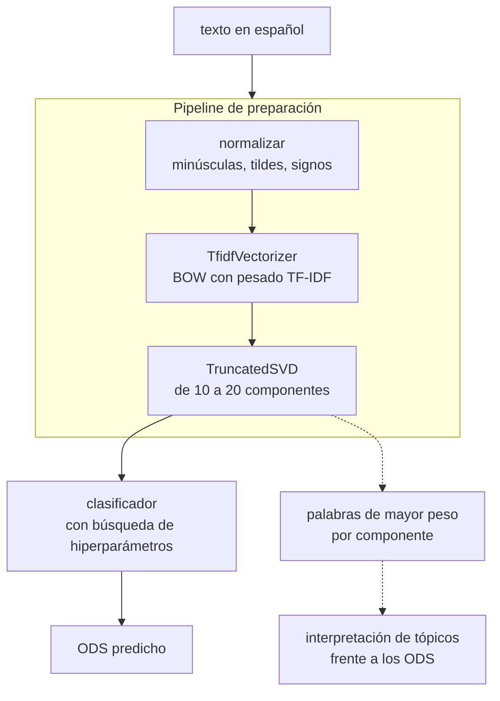

# Clasificación de textos según los Objetivos de Desarrollo Sostenible

Solución de procesamiento de lenguaje natural que toma un texto en español y lo relaciona con
uno de los Objetivos de Desarrollo Sostenible de la Agenda 2030. El corpus son párrafos
etiquetados por voluntarios del proyecto OSDG, traducidos al español y aumentados. El método
representa cada documento con TF-IDF, lo proyecta a un espacio de pocas dimensiones con SVD
truncado, que a la vez sirve de modelo de tópicos (LSA), y clasifica sobre esa representación.

> Micro proyecto 2 del curso ML No Supervisado, Universidad de los Andes (bimestre 2026-14).
> Autores: Juan David Lara Camacho, Miguel. Entrega: domingo 20 de septiembre de 2026.



La misma descomposición cumple dos papeles que el enunciado califica por separado: es el modelo
de tópicos del 15% y es la reducción de dimensionalidad que exige el 30% del modelo. El
enunciado lo autoriza de forma explícita.

## El entregable

El entregable son dos archivos, `notebooks/Microproyecto_2.ipynb` y su versión en HTML, y el
calificador no recibe este repositorio: el resto es andamiaje. La rúbrica completa está en
[`Enunciado.md`](Enunciado.md), que además trae las **notas de lectura**: lo que el corpus tiene
de verdad y los puntos de la rúbrica que se pierden por olvido.

| Actividad | Peso |
|---|---|
| Preparación de los datos, con la reducción de dimensionalidad justificada | 30% |
| Pipeline de preparación | 15% |
| Clasificador con búsqueda de hiperparámetros y métricas justificadas | 30% |
| Clasificación de al menos cuatro textos no vistos | 10% |
| LSA sobre TF-IDF e interpretación de al menos 5 tópicos | 15% |
| *Opcional:* aplicación en Streamlit | *+15 puntos* |

## Los datos

`data/Train_textosODS.xlsx`, descargado de Coursera. **9.656 textos y dos columnas**, `textos` y
`ODS`, sin nulos ni duplicados exactos. Tres hechos que condicionan el diseño y que el enunciado
no menciona:

- **Son 16 clases, no 17.** El ODS 17 no aparece en el archivo.
- **Desbalance de 3,5 a 1**, entre el ODS 16 con 1.080 textos y el ODS 12 con 312. La exactitud
  sola no sirve: la métrica principal es F1 macro y la partición va estratificada.
- **Párrafos de tamaño medio**, mediana de 105 palabras, entre 24 y 268.

Todo eso lo mide `scripts/perfilar_corpus.py`, que además busca variantes casi idénticas
producto de la aumentación con ChatGPT y no encuentra ninguna sobre una muestra de 2.000.

## Uso

```bash
python scripts/perfilar_corpus.py          # qué trae el corpus, antes de decidir nada
python scripts/barrer_preparacion.py       # qué decisiones de preparación importan (ninguna)
jupyter lab notebooks/Microproyecto_2.ipynb
python scripts/exportar_entrega.py         # deja el .ipynb y el .html en entrega/
```

El entorno del bimestre (`C:\Users\LaraJ\Envs\miad-2026-14`) ya tiene todo; para uno propio,
`uv venv .venv --python 3.12` y `uv pip install -r requirements.txt`.

## Estructura

```
Proyecto2/
├── Enunciado.md                     el enunciado del curso, con las notas de lectura del corpus
├── AGENTS.md                        cómo se trabaja aquí, humano o agente
├── docs/
│   ├── estrategia.md                la investigación previa: qué tipo de problema es este
│   └── decisiones.md                las cinco decisiones del método, con su argumento y su cierre
├── data/
│   └── Train_textosODS.xlsx         9.656 textos etiquetados con su ODS
├── notebooks/
│   └── Microproyecto_2.ipynb        el entregable, autocontenido
├── scripts/
│   ├── perfilar_corpus.py           clases, desbalance, longitudes, casi duplicados
│   ├── barrer_preparacion.py        cuánto cambia el desempeño con cada decisión de preparación
│   └── exportar_entrega.py          deja el .ipynb y el .html listos para Coursera
├── results/
│   └── estructura_de_los_errores.png
└── requirements.txt
```

**Por dónde entrar.** Primero [`docs/estrategia.md`](docs/estrategia.md), que es lo que cambia
cómo se aborda el problema; después [`Enunciado.md`](Enunciado.md), por la rúbrica y por lo que es
fácil perder de ella; y con eso, el notebook.

## La investigación previa

Antes de escribir el método medimos qué tipo de problema es este, y el resultado cambia lo que hay
que reportar: **la etiqueta única no es una propiedad de los textos sino del procedimiento con que
los anotaron**, y los errores del clasificador reproducen la estructura temática de la Agenda
2030. El argumento completo, con la evidencia, está en
[`docs/estrategia.md`](docs/estrategia.md), y la figura en
[`results/estructura_de_los_errores.png`](results/estructura_de_los_errores.png).

## El notebook

Las secciones van en el orden de los criterios de evaluación, y cada una dice qué se califica
ahí y con qué peso. El notebook no nombra este repositorio ni sus rutas: el calificador recibe
dos archivos y no la carpeta.

| Sección | Qué construye | Peso | Estado |
|---|---|---|---|
| 1 | Los datos: carga, distribución de clases, partición estratificada | | **corre** |
| 2 | Preparación de los textos y pipeline | 30% + 15% | **corre** |
| 3 | LSA: tópicos e interpretación frente a los ODS | 15% | **corre** |
| 4 | Clasificación con búsqueda de hiperparámetros | 30% | **corre** |
| 5 | Desempeño sobre textos no vistos | 10% | **corre** |
| 6 | Conclusiones | | **corre** |

Se guarda **sin salidas** mientras se desarrolla, según [`AGENTS.md`](AGENTS.md); solo la corrida
final va con todas las celdas ejecutadas, porque el enunciado lo exige. Correrlo completo toma
unos seis minutos, casi todos en la búsqueda de hiperparámetros de la sección 4.2.

### Antes de entregar

Esta lista vivía al final del notebook y se movió aquí: es control nuestro, no parte de lo que
lee el calificador. Los nueve puntos están verificados al 12 de septiembre de 2026.

- [x] El notebook corre de punta a punta, en orden, sin errores
- [x] Cada decisión tiene su justificación escrita al lado, no solo el código
- [x] El pipeline es un objeto de scikit-learn y procesa un texto nuevo de principio a fin
- [x] Hay búsqueda de hiperparámetros, y se dice por qué ese espacio y esa métrica
- [x] Se interpretan al menos cinco componentes frente a los ODS
- [x] Se muestran al menos cuatro textos de prueba clasificados (son seis)
- [x] Se dice que son 16 clases y no 17, y por qué
- [x] Se declara que el corpus está traducido automáticamente y aumentado
- [ ] Todas las celdas quedan con su salida visible, que es cosa de la exportación final

## Estado

**12 de septiembre de 2026. El método está completo y el notebook corre de punta a punta.** Las
cinco decisiones están cerradas en [`docs/decisiones.md`](docs/decisiones.md).

El modelo final es TF-IDF con 8.353 términos, SVD truncada a 500 componentes, normalización de
las filas y regresión logística con `C = 3`. Sobre los **1.932 textos de prueba que nunca vio**
alcanza:

| | |
|---|---|
| Exactitud | **0,8758** |
| F1 macro | **0,8478** |
| Exactitud top-2 | **0,9482** |

Cuatro resultados que conviene conocer antes de leer el notebook:

1. **Veinte componentes no bastan.** El rango que sugiere el enunciado da 0,755 de F1 macro
   contra 0,850 sin reducir, y hacen falta quinientas para empatar. Van dos descomposiciones,
   veinte para los tópicos y quinientas para clasificar, que el enunciado autoriza.
2. **La SVD no mejora el desempeño, lo iguala.** Se justifica por lo que habilita, un modelo
   dieciséis veces más pequeño y las componentes interpretables, no por lo que mejora.
3. **Ninguna decisión de preparación del texto importa.** Todas las configuraciones medidas
   caben en menos de una centésima de F1 macro, por debajo del ruido entre particiones, así que
   se escogieron por el tamaño del vocabulario. Las mediciones están en
   [`scripts/barrer_preparacion.py`](scripts/barrer_preparacion.py).
4. **Los errores son dudas, no disparates.** De los 240 errores, en 140 el ODS correcto quedó
   segundo, y la confianza media cae de 0,872 cuando acierta a 0,532 cuando falla. La estructura
   de las confusiones sobre datos no vistos replica la que
   [`docs/estrategia.md`](docs/estrategia.md) había hallado antes de escribir el método.

Lo único pendiente es la **app de Streamlit** de los 15 puntos opcionales, que ahora sí es media
tarde de trabajo porque el pipeline está cerrado y el modelo se serializa con `joblib.dump`.
