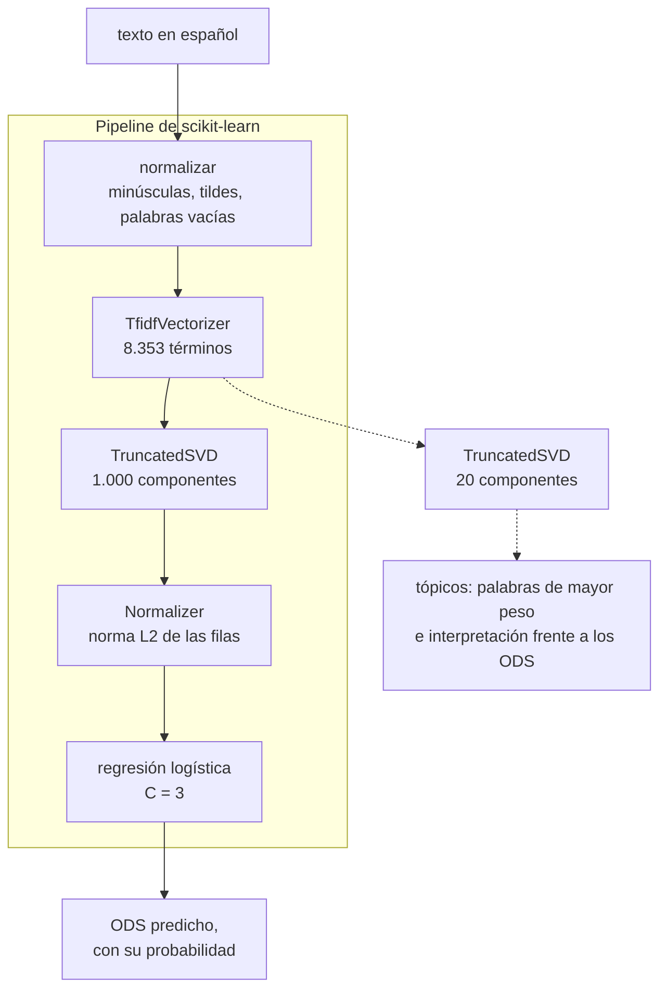

# Clasificación de textos según los Objetivos de Desarrollo Sostenible

Toma un párrafo en español y dice a cuál de los Objetivos de Desarrollo Sostenible de la Agenda
2030 corresponde. El corpus son textos etiquetados por voluntarios del proyecto OSDG, traducidos
al español y aumentados. El método representa cada documento con TF-IDF, lo proyecta con SVD
truncada, que además sirve de modelo de tópicos por análisis semántico latente, y clasifica sobre
esa representación.

> Micro proyecto 2 de ML No Supervisado, Universidad de los Andes, bimestre 2026-14.
> Autores: Juan David Lara Camacho, Miguel. Entrega: domingo 20 de septiembre de 2026.

## El resultado

Sobre los 1.932 textos que el modelo nunca vio:

| Exactitud | F1 macro | Exactitud top-2 |
|---|---|---|
| **0,8851** | **0,8595** | **0,9586** |

Cuatro hallazgos explican por qué el método es el que es. Los cuatro están medidos en el
notebook y argumentados en [`docs/decisiones.md`](docs/decisiones.md).

1. **Veinte componentes no bastan.** El rango que sugiere el enunciado da 0,755 de F1 macro
   contra 0,850 sin reducir, con el mismo clasificador sin ajustar. Con la regularización
   ajustada, la búsqueda escoge mil componentes por la regla de una desviación. De ahí que haya
   dos descomposiciones y no una.
2. **La SVD no mejora el desempeño ni achica el modelo.** Con la regularización ajustada, no
   reducir da 0,864 de F1 macro y el modelo elegido 0,856, y la matriz de la SVD hace al modelo
   unas sesenta veces más grande. Se justifica porque el enunciado la exige y por lo que
   habilita, unas componentes interpretables y un espacio denso donde comparar algoritmos, no
   por una mejora que no existe.
3. **Ninguna decisión de preparación del texto importa.** Todas las configuraciones medidas
   caben en menos de una centésima de F1 macro, por debajo del ruido entre particiones, así que
   se escogieron por el tamaño del vocabulario.
4. **Los errores son dudas, no disparates.** De los 222 errores, en 142 el ODS correcto quedó
   segundo, y la confianza media cae de 0,853 cuando acierta a 0,510 cuando falla. Las
   confusiones se concentran entre objetivos que la propia Agenda 2030 agrupa.

## El método



**Son dos descomposiciones, y esa es la decisión de fondo.** Veinte componentes producen tópicos
legibles pero no separan dieciséis clases, así que la interpretación usa veinte y el clasificador
mil. El enunciado lo autoriza de forma explícita: su actividad 3 permite reutilizar la
descomposición de la actividad 2 o aplicar otra reducción que se considere pertinente.

Antes de escribir el método medimos qué tipo de problema es este, y el resultado cambia lo que
hay que reportar: **la etiqueta única no es una propiedad de los textos sino del procedimiento
con que los anotaron**. El argumento, con su evidencia, está en
[`docs/estrategia.md`](docs/estrategia.md).

## El entregable

Dos archivos, [`notebooks/Microproyecto_2.ipynb`](notebooks/Microproyecto_2.ipynb) y su versión
en HTML. El calificador no recibe este repositorio, así que el notebook es autocontenido y no
nombra ninguna de estas rutas: el resto es andamiaje. La rúbrica completa, con las notas de
lectura del corpus, está en [`Enunciado.md`](Enunciado.md).

| Sección del notebook | Qué se califica ahí | Peso |
|---|---|---|
| 1. Los datos | carga, distribución de clases y partición estratificada | |
| 2. Preparación y pipeline | preparación de los datos con la reducción justificada, más el pipeline | 30% + 15% |
| 3. Modelo de tópicos con LSA | interpretación de al menos cinco componentes frente a los ODS | 15% |
| 4. Modelo de clasificación | clasificador con búsqueda de hiperparámetros y métricas justificadas | 30% |
| 5. Textos no vistos | clasificación de al menos cuatro textos de prueba | 10% |
| 6. Conclusiones | | |
| 7. Anexo | la aplicación interactiva, con sus capturas | |
| *opcional* | *aplicación interactiva en Streamlit, en `app/`* | *+15 puntos* |

Correrlo completo toma unos trece minutos en el entorno del bimestre, repartidos sobre todo
entre el ajuste del bloque de preparación de la sección 2.3, la curva de la sección 3.2 y la
búsqueda de hiperparámetros de la sección 4.2, que prueba descomposiciones de hasta 2.000
componentes. Se guarda **sin salidas** mientras se desarrolla, según
[`AGENTS.md`](AGENTS.md); solo la corrida final va con todas las celdas ejecutadas, porque el
enunciado lo exige.

## La aplicación

Los 15 puntos opcionales del enunciado. Recibe texto libre, lo procesa con el mismo pipeline y
devuelve el ODS predicho con su probabilidad.

Hace además dos cosas que salen de los hallazgos del proyecto y no del enunciado. **Propone un
segundo objetivo cuando es plausible**, porque en la evaluación el segundo candidato contiene el
objetivo correcto en el 64% de los errores; y cuando los dos primeros quedan a menos de 0,10 de
distancia **marca el texto como transversal** en vez de forzarle una etiqueta, que es el caso del
6,5% de los textos y donde se concentra el 33% de los errores. Tampoco clasifica un texto sin
ningún término del vocabulario: avisa en vez de responder sin base.

Cuando el modelo está seguro, en cambio, no ofrece nada más: un segundo objetivo al 0,4% no es
información, es ruido que resta credibilidad a la respuesta.

```bash
python app/modelo.py          # entrena una vez, unos minutos, y deja el modelo en la caché
streamlit run app/app.py
```

El modelo entrenado pesa 73 MB, así que no se versiona ni se guarda en el Drive: vive en la
caché local, junto a la de las demás herramientas del bimestre. Si la aplicación no lo
encuentra, lo entrena ella misma la primera vez.

## Los datos

`data/Train_textosODS.xlsx`, descargado de Coursera: **9.656 textos y dos columnas**, `textos` y
`ODS`, sin nulos ni duplicados exactos. Tres hechos que el enunciado no menciona y que
condicionan todo el diseño:

- **Son 16 clases, no 17.** El ODS 17 no aparece en el archivo, de modo que el sistema no lo
  puede predecir nunca.
- **Desbalance de 3,5 a 1**, entre el ODS 16 con 1.080 textos y el ODS 12 con 312. Por eso la
  métrica principal es F1 macro y la partición va estratificada.
- **Párrafos de tamaño medio**, mediana de 105 palabras, entre 24 y 268.

Los mide [`scripts/perfilar_corpus.py`](scripts/perfilar_corpus.py), que además descarta que la
aumentación con ChatGPT haya dejado variantes casi idénticas a lado y lado de la partición.

## Cómo se usa

```bash
python scripts/perfilar_corpus.py               # qué trae el corpus
python scripts/barrer_preparacion.py            # qué decisiones de preparación importan
jupyter lab notebooks/Microproyecto_2.ipynb     # el método
python scripts/exportar_entrega.py --ejecutar   # corre el notebook y deja los dos archivos
```

El entorno del bimestre ya tiene todo lo necesario. Para montar uno propio, `uv venv .venv
--python 3.12` y `uv pip install -r requirements.txt`.

## Qué hay aquí

```
Proyecto2/
├── Enunciado.md                  el enunciado del curso, con las notas de lectura del corpus
├── AGENTS.md                     cómo se trabaja aquí, humano o agente
├── docs/
│   ├── estrategia.md             la investigación previa: qué tipo de problema es este
│   └── decisiones.md             las cinco decisiones del método, con su argumento y su cierre
├── data/
│   └── Train_textosODS.xlsx      9.656 textos etiquetados con su ODS
├── notebooks/
│   └── Microproyecto_2.ipynb     el entregable, autocontenido
├── app/
│   ├── modelo.py                 define, entrena y guarda el pipeline que sirve la aplicación
│   └── app.py                    la interfaz de Streamlit, los 15 puntos opcionales
├── scripts/
│   ├── perfilar_corpus.py        clases, desbalance, longitudes, casi duplicados
│   ├── barrer_preparacion.py     cuánto cambia el desempeño con cada decisión de preparación
│   └── exportar_entrega.py       deja el .ipynb y el .html listos para Coursera
├── results/
│   └── estructura_de_los_errores.png
└── requirements.txt
```

**Por dónde entrar.** Primero [`docs/estrategia.md`](docs/estrategia.md), que es lo que cambia
cómo se aborda el problema. Después [`Enunciado.md`](Enunciado.md), por la rúbrica y por lo que
es fácil perder de ella. Y con eso, el notebook.

## Antes de entregar

Control nuestro, no parte de lo que lee el calificador. Verificado el 14 de septiembre de 2026,
revisado el 15 tras la revisión cruzada y corrido entero el 18.

- [x] El notebook corre de punta a punta, en orden, sin errores
- [x] Cada decisión tiene su justificación escrita al lado, no solo el código
- [x] El pipeline es un objeto de scikit-learn y procesa un texto nuevo de principio a fin
- [x] Hay búsqueda de hiperparámetros, y se dice por qué ese espacio y esa métrica
- [x] Se interpretan al menos cinco componentes frente a los ODS
- [x] Se muestran al menos cuatro textos de prueba clasificados, que son seis
- [x] Se dice que son 16 clases y no 17, y por qué
- [x] Se declara que el corpus está traducido automáticamente y aumentado
- [x] La aplicación de Streamlit corre y clasifica texto libre
- [x] Revisión cruzada con Miguel
- [x] El notebook revisado corre de punta a punta, con la rejilla completa
- [x] Las capturas de la aplicación están pegadas en el anexo 7 del notebook
- [x] Todas las celdas quedan con su salida visible
