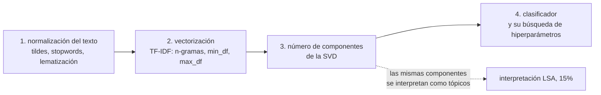

# Decisiones del método

Las decisiones del micro proyecto 2, con su argumento y su fecha de cierre. **Las cinco están
cerradas**, todas el 12 de septiembre de 2026, y la 3 y la 4 se revisaron el 15, como cuenta
la bitácora. El criterio de estilo es el mismo del micro proyecto 1: cada decisión vive
como parámetro con valor por defecto del estimador que la usa, y se argumenta en la sección del
notebook donde aparece.

Las cuatro decisiones grandes y cómo dependen entre sí:

La 3 era la que amarraba todo, y se resolvió midiendo. La sospecha era que 20 componentes fueran
un espacio pequeñísimo para separar 16 clases, y quedó confirmada: **lo que sirve para
interpretar no es lo que sirve para clasificar**, así que van dos descomposiciones distintas.
El detalle está abajo.

## 1. Normalización del texto

**Cerrada el 12 de septiembre de 2026.** Minúsculas y `strip_accents="unicode"`, patrón de
tokens de solo letras con dos caracteres o más, lista propia de 174 palabras vacías del español,
sin lematización ni stemming.

| Qué | Decisión | Por qué |
|---|---|---|
| Minúsculas y tildes | se unifican | no aporta nada medible, pero tampoco cuesta, y cubre el acentuado irregular que pueda haber dejado la aumentación |
| Números | se descartan | conservarlos agrega 229 términos y no mejora; "2030" parecía informativo y no lo es |
| Palabras vacías | lista propia, 174 formas, **sin tildes** | `TfidfVectorizer` solo trae inglés. El filtro se aplica después de `strip_accents`, así que una lista acentuada queda inerte sin avisar |
| Lematización | no | exige nltk o spaCy, que el pipeline tendría que cargar también al procesar un texto nuevo. Es decisión de dependencias, no medición, y se declara como tal en el notebook |

La lista de palabras vacías no incluye vocabulario del dominio. Términos como "desarrollo" o
"países" discriminan poco entre ODS, pero quitarlos a mano sería decidir por el modelo algo que
el pesado IDF ya penaliza por su cuenta.

## 2. Vectorización TF-IDF

**Cerrada el 12 de septiembre de 2026.** Unigramas, `min_df=5`, `sublinear_tf=True`, sin
`max_df` ni `max_features`. Vocabulario resultante de **8.353 términos** sobre 7.724 documentos
de entrenamiento, matriz al 0,51% de densidad, 42 términos por documento.

| Parámetro | Valor | Por qué |
|---|---|---|
| `ngram_range` | `(1, 1)` | los bigramas suben el vocabulario a 13.884 y no mejoran |
| `min_df` | 5 | baja el vocabulario de 15.807 a 8.353 sin costo. No sube más por el desbalance: el ODS 12 tiene unos 250 textos en entrenamiento, así que un `min_df` de 10 exigiría el 4% de esa clase |
| `max_df` | sin fijar | **inerte en este corpus**: el término más frecuente es "países" con el 22% de los documentos, así que cualquier umbral razonable no elimina nada. Se dice, en vez de fijar un número que no hace nada |
| `sublinear_tf` | `True` | en párrafos de mediana 105 palabras, un término que aparece cinco veces no es cinco veces más relevante. La ganancia medida es de dos milésimas, dentro del ruido, pero el argumento corresponde a documentos de este tamaño |

**El hallazgo que cierra las dos decisiones.** Medidas con
[`../scripts/barrer_preparacion.py`](../scripts/barrer_preparacion.py) y reproducidas en la
sección 2.4 del notebook, todas las configuraciones medidas, diecisiete en el barrido y siete en
el notebook, caben entre 0,8411 y 0,8497 de F1 macro, mientras que la desviación entre las cinco
particiones de la validación cruzada está entre 0,008 y 0,012.
**Ninguna decisión de preparación es distinguible del ruido de partición.**
La única que se le acerca es quitar las palabras vacías, que cuesta seis milésimas.

Eso cambia el criterio: si el desempeño no decide, deciden el tamaño de la matriz que recibe la
SVD y la interpretabilidad de los tópicos, y por eso la configuración elegida es la de
vocabulario pequeño. Un espacio de entrada más pequeño es además menos ocasión de sobreajuste en
la búsqueda de hiperparámetros de la decisión 4.

## 3. Número de componentes de la SVD

**Cerrada el 12 de septiembre de 2026. Dos descomposiciones**, más un `Normalizer` detrás de
ambas. Veinte componentes para los tópicos, que es la actividad 2 del enunciado, y una
descomposición ancha para clasificar, cuyo tamaño exacto entra como hiperparámetro en la
búsqueda de la decisión 4. El enunciado lo autoriza: la actividad 3 permite reutilizar la
descomposición de la actividad 2 **o aplicar otra técnica de reducción que se considere
pertinente**.

| Componentes | Varianza explicada | F1 macro normalizado | Sin normalizar |
|---|---|---|---|
| 10 | 3,3% | 0,6112 | 0,4801 |
| 20 | 5,1% | **0,7549** | 0,7014 |
| 50 | 9,1% | 0,8163 | 0,7861 |
| 100 | 14,2% | 0,8299 | 0,8052 |
| 300 | 28,5% | 0,8412 | 0,8273 |
| 500 | 38,3% | **0,8492** | 0,8324 |
| sin reducir | | **0,8497** | |

**Veinte componentes no bastan.** El F1 macro cae a 0,755 contra los 0,850 de la línea base, y la
desviación entre particiones en ese punto es de 0,002, así que no es ruido. Con este clasificador
sin ajustar, recuperar la línea base exige quinientas componentes; con la regularización
ajustada, la búsqueda de la decisión 4 escoge mil. Eso ocurre aunque quinientas expliquen apenas
el 38% de la varianza: conservar varianza y conservar señal no son lo mismo, y elegir el número
de componentes por la varianza explicada, en un problema de texto, lleva a elegir mal.

**El `Normalizer` es la primera decisión del proyecto que se mueve más allá del ruido**, y su
efecto decrece con el número de componentes: 0,131 de F1 macro con diez, 0,054 con veinte, 0,017
con quinientas. La razón se midió. TF-IDF entrega filas de norma L2 exactamente uno; tras la SVD
de veinte componentes las normas quedan entre 0,060 y 0,512, un factor de 8,6, porque cada
documento conserva solo la parte de sí mismo que cae en el subespacio. Esa magnitud es una
propiedad de la proyección y no del tema del texto, y un clasificador lineal la lee como señal.
Con quinientas componentes la dispersión baja a un factor de 2,5 y el problema casi desaparece.

**Y los tópicos de las veinte sí son legibles**, que es lo que justifica quedarse con ellas para
la actividad 2. Cinco componentes corresponden a un ODS único (la 2 al ODS 16, la 3 al ODS 4, la
5 al ODS 3, la 6 al ODS 6, la 7 al ODS 7), la componente 1 es el eje de asuntos humanos contra
sistemas técnicos y ambientales, que reproduce la partición mayor de la Agenda 2030 hallada en
[`estrategia.md`](estrategia.md) por otra vía, y la componente 0 es la dirección media del corpus
y no un tópico. Entre las veinte, los dieciséis ODS dominan un extremo de alguna: **alcanzan para
nombrar los objetivos, no para separarlos**.

## 4. Clasificador

**Cerrada el 12 de septiembre de 2026 y revisada el 15. Regresión logística**, sin reponderar las
clases, con `C = 3` y 1.000 componentes, elegidos por `GridSearchCV` sobre dieciséis
combinaciones con la regla de una desviación: entre las combinaciones cuyo F1 macro medio queda a
menos de una desviación entre particiones de la mejor, la de menos componentes. F1 macro de
**0,8556** en validación cruzada.

| Componentes | Mejor `C` | F1 macro | Desviación |
|---|---|---|---|
| 300 | 1 | 0,8412 | 0,0038 |
| 500 | 3 | 0,8511 | 0,0072 |
| **1.000** | **3** | **0,8556** | 0,0089 |
| 2.000 | 10 | 0,8614 | 0,0068 |
| sin reducir | 30 | 0,8640 | 0,0063 |

El umbral de la regla es 0,8614 menos 0,0068, es decir 0,8546: mil componentes entran y
quinientas no.

Los seis candidatos, sobre 300 componentes normalizadas:

| Candidato | F1 macro | Exactitud |
|---|---|---|
| **Regresión logística** | **0,8412** | 0,8681 |
| SVM lineal | 0,8391 | 0,8669 |
| Regresión logística, `class_weight="balanced"` | 0,8387 | 0,8635 |
| Naive Bayes gaussiano | 0,8074 | 0,8338 |
| k vecinos, k = 15, coseno | 0,8048 | 0,8383 |
| Bosque aleatorio, 300 árboles | 0,7859 | 0,8265 |

**Los tres candidatos no lineales pierden por entre 3,4 y 5,5 puntos.** Las componentes de la SVD
ya son combinaciones lineales de términos ajustadas a la estructura del corpus, de modo que la
frontera útil en ese espacio es aproximadamente lineal y buscar interacciones entre componentes
gasta capacidad en una estructura que no está. Entre la logística y el SVM, que empatan dentro
del ruido, decide que la logística entrega **probabilidades**, que la sección 5 del notebook
necesita para el top-2 y que la app de Streamlit necesitaría para mostrar confianza.

**`class_weight="balanced"` no ayuda**, y conviene decirlo porque es contraintuitivo. Con un
desbalance de 3,5 a 1 lo de manual sería reponderar, pero el desbalance es moderado y la clase
más pequeña tiene 312 textos, suficientes para estimar su frontera. Reponderar mueve el umbral a
favor de clases que no lo necesitaban y le cuesta precisión a las grandes. El F1 macro ya se
encarga de que las pequeñas cuenten igual.

**Sobre la reducción de la dimensionalidad, con todas sus letras.** Con la regularización
ajustada en los dos lados, la línea base sin reducir alcanza 0,8640 y el modelo elegido 0,8556:
**la SVD no mejora el desempeño**, cuesta ocho milésimas con mil componentes y tres con dos mil.
**Tampoco achica el modelo**: la matriz de la SVD guarda 8.353.000 números, contra los 133.664
de la regresión logística sobre TF-IDF, así que el modelo reducido es unas sesenta veces más
grande. Lo que aporta es otra cosa: una representación densa que admite algoritmos que no
toleran matrices dispersas, y las componentes interpretables de la decisión 3. Se justifica por lo que
habilita y porque el enunciado la exige, no por lo que mejora, y presentarla como mejora sería
falsear el resultado.

## 5. Cómo se reporta el desempeño

**Abierta, y es la decisión propia del proyecto.** La exactitud castiga igual cualquier error, y
[`estrategia.md`](estrategia.md) muestra que en este problema los errores tienen estructura: el
62% de ellos tienen el ODS correcto en segunda posición y un tercio son empates técnicos. Lo que
hay que decidir es qué se reporta además del F1 macro: costo del error según las cinco P, top-2,
o una regla de abstención para los textos transversales. Las tres ideas están argumentadas en la
sección 6 de ese documento.

**Cerrada el 12 de septiembre de 2026.** Se reportan **F1 macro y exactitud** como métricas
principales, más el desglose por clase y la matriz de confusión, y encima de eso la **exactitud
top-2** con el análisis de la confianza. Es decir, la idea 2 de [`estrategia.md`](estrategia.md).
La idea 4, leer los tópicos contra los bloques temáticos en vez de contra los ODS uno a uno, ya
quedó incorporada en la decisión 3. Se descartan la idea 1, la matriz de costo de las cinco P, y
la idea 5, recuperar el `agreement` del corpus original.

El criterio del recorte no fue técnico sino de longitud: el micro 1 quedó en 93 celdas y 12.400
palabras de prosa, y el argumento propio debe contarse una sola vez. Aquí se cuenta en la
sección 5.1 del notebook y en las conclusiones, no tres veces.

**Y la evidencia replicó sobre datos no vistos**, que era lo que había que comprobar. Sobre los
1.932 textos de prueba, con el modelo revisado el 15 de septiembre: de los 222 errores, en 142 el
ODS correcto quedó segundo, el 64%; la exactitud sube de 0,8851 en top-1 a **0,9586 en top-2**;
la confianza media es de 0,853 cuando acierta y 0,510 cuando falla; y los 126 textos con margen
menor que 0,10 entre el primer y el segundo objetivo, el 6,5% del conjunto, concentran el 33%
de todos los errores. Las cifras de la investigación previa se sostienen fuera de la muestra
con que se hallaron.

## Bitácora

**15 de septiembre de 2026.** Revisión cruzada del notebook. Tres afirmaciones no se sostenían y
se corrigieron. La primera, que el modelo reducido fuera dieciséis veces más pequeño: la matriz
de la SVD lo hace unas sesenta veces más grande que la logística sobre TF-IDF. La segunda, que la
SVD igualara a la línea base: la comparación enfrentaba el modelo reducido con su `C` ajustado
contra el TF-IDF con el `C` por omisión, y con la regularización ajustada la línea base llega a
0,8640. La tercera, que quinientas componentes fueran el óptimo: estaban en el borde de la
rejilla y el desempeño seguía subiendo.

La rejilla se amplió a 300, 500, 1.000 y 2.000 componentes, con la regla de una desviación para
escoger, y la decisión 4 quedó en mil componentes y `C = 3`. Sobre los 1.932 textos de prueba el
modelo da **0,8851 de exactitud y 0,8595 de F1 macro**, con un intervalo del 95% por remuestreo
entre 0,841 y 0,877, y **0,9586 de top-2**. El modelo de la aplicación pasa de 37 a 73 MB.

Se agregaron al notebook cinco cosas: la comprobación de casi duplicados entre prueba y
entrenamiento, que cierra la medición pendiente de `Enunciado.md` (ningún texto de prueba llega a
0,9 de similitud y solo dos pasan de 0,8); el intervalo por remuestreo; la tabla de calibración,
con un error esperado de 0,072 y probabilidades conservadoras por debajo de 0,9, que es por lo
que el notebook ya no las llama calibradas; tres textos escritos a mano que pasan por el pipeline
completo; y el anexo de la aplicación, que espera sus capturas. El pipeline se arma ahora en una
sola función, `construir_pipeline`, que usan todas las mediciones. La corrida de verificación se
hizo con la rejilla por partes y sin el bosque aleatorio de la sección 4.1, cuyos resultados no
cambian; falta la corrida completa en el entorno del bimestre.

La aplicación ya no clasifica un texto sin ningún término del vocabulario. Antes respondía
"texto transversal, ODS 3 y ODS 4" al 12% para cualquier cadena sin sentido, porque el TF-IDF
vacío deja al modelo solo con sus sesgos.

**14 de septiembre de 2026.** Se hace la aplicación de Streamlit, los 15 puntos opcionales, en
`app/`. Recibe texto libre, lo procesa con el mismo pipeline y devuelve el ODS con su
probabilidad. Además propone siempre el segundo objetivo más probable y marca como transversal
el texto cuyos dos primeros quedan a menos de 0,10, que es la conclusión del proyecto llevada a
la interfaz.

Tres decisiones de ingeniería. El modelo entrenado pesa 37 MB y entrenarlo toma unos minutos, así
que no se versiona ni se guarda en el Drive: queda en la caché local junto a la de las demás
herramientas del bimestre, y la aplicación lo carga en 0,3 segundos. Entrena sobre el corpus
completo y no sobre el 80%, porque aquí se sirve y no se mide, y la barra lateral dice
explícitamente que las métricas que muestra vienen de la evaluación con partición y no de este
modelo. Y el pipeline está definido en `app/modelo.py` y otra vez en el notebook, por la regla de
siempre: el notebook no puede importar nada del repositorio.

Las cinco rutas de la interfaz quedaron probadas sin navegador con `streamlit.testing`: arranque,
clasificar en vacío, el ejemplo, el aviso de texto corto y el de texto transversal. **El ejemplo
que traía la aplicación al principio clasificaba mal**, un párrafo sobre acueducto rural que el
modelo mandaba a ODS 3 salud con 50,9% en vez de ODS 6. Se cambió por uno de saneamiento básico,
que sale ODS 6 con 99,8%. La confusión era legítima, calidad del agua lleva a salud, pero como
ejemplo de bienvenida no servía.

**12 de septiembre de 2026, noche.** Secciones 4, 5 y 6 escritas, decisiones 4 y 5 cerradas y el
método completo. El notebook corre de punta a punta y el modelo final da **0,8758 de exactitud y
0,8478 de F1 macro** sobre los 1.932 textos de prueba, con 0,9482 de top-2.

Lo que hay que mirar antes de entregar, porque es lo único que un calificador podría objetar: el
F1 macro de tres clases está por debajo de 0,72, el ODS 8 trabajo en 0,604, el ODS 10 desigualdad
en 0,662 y el ODS 9 industria en 0,719. No es un problema de tamaño de clase, el ODS 12 tiene
menos textos y saca 0,817; es solapamiento temático, y son justo los objetivos que la componente
1 de la SVD agrupa. Está explicado en la sección 5, con la matriz de confusión al lado, así que
la objeción viene respondida de antemano.

Queda fuera, y es decisión suya: la app de Streamlit de los 15 puntos, que ahora sí es media
tarde de trabajo porque el pipeline está cerrado y el modelo se serializa con `joblib.dump`.

**12 de septiembre de 2026, tarde.** Sección 3 escrita y decisión 3 cerrada. El resultado
confirma la sospecha del plan, con número: veinte componentes dan 0,755 de F1 macro contra 0,850
sin reducir, y hacen falta quinientas para empatar. Van dos descomposiciones, veinte para los
tópicos y una ancha para clasificar, y el tamaño de la segunda se cierra en la búsqueda de
hiperparámetros en vez de fijarse a mano.

Aparecieron dos cosas que no estaban previstas. La primera es el `Normalizer` detrás de la SVD,
que es la única decisión del proyecto que se mueve más allá del ruido, y de la que además se
midió el mecanismo. La segunda es que los tópicos salieron **mejor** de lo que anticipaba
[`estrategia.md`](estrategia.md): la idea 4 esperaba que ninguna componente correspondiera a un
ODS, y en realidad cinco corresponden a uno solo, además del eje de bloques temáticos que sí se
esperaba. La sección lo reporta como se midió y no como se había predicho.

El notebook va en 43 celdas y 3.319 palabras con tres de las seis secciones hechas. A este ritmo
cierra cerca de las 5.000, por encima de las 4.000 del presupuesto, así que las secciones 4 a 6
hay que escribirlas más apretadas.

**12 de septiembre de 2026.** Fase 2 del plan. Se cierran las decisiones 1 y 2 y queda escrita
la sección 2 del notebook, que corre de punta a punta: normalización, vectorización, el
`Pipeline` y la tabla de la línea base. **La línea base queda en 0,8497 de F1 macro y 0,8747 de
exactitud** sobre la partición de entrenamiento, medida con validación cruzada estratificada de
cinco particiones. No es comparable de frente con el 0,8886 y el 0,8659 de
[`estrategia.md`](estrategia.md), que se midieron sobre el corpus completo: aquí cada partición
entrena con el 64% del corpus. La diferencia es de datos, no de método, y está dicho en el
notebook.

El hallazgo del día es negativo y por eso vale: **ninguna decisión de preparación mueve el
desempeño más allá del ruido entre particiones**, así que la preparación se elige por el tamaño
del vocabulario y no por el F1. Eso ahorra discusión y acorta el notebook, que es lo que se
buscaba después de que el micro 1 quedó en 93 celdas y 12.400 palabras.

De paso se quitaron del notebook las cinco referencias a `docs/` y a rutas de este repositorio,
que la regla 7 de `AGENTS.md` prohíbe porque el calificador recibe dos archivos y no la carpeta.

**31 de agosto de 2026, tarde.** Investigación previa al método, en
[`estrategia.md`](estrategia.md). Tres hallazgos: la línea base TF-IDF más logística ya da 0,8886
de exactitud y 0,8659 de F1 macro; los errores del modelo agrupan los ODS en bloques que
coinciden con las taxonomías oficiales de la Agenda 2030; y el OSDG documenta que **a los
anotadores nunca se les permitió asignar más de un ODS por texto**, de modo que la monoetiqueta
es una restricción del procedimiento y no un hecho de los datos.

**31 de agosto de 2026.** Se monta el repositorio y se perfila el corpus. Tres hallazgos que
condicionan el diseño y que ya están en `Enunciado.md`: son 16 clases y no 17, el desbalance es
de 3,5 a 1, y no hay variantes casi idénticas por la aumentación con ChatGPT (ningún par con
coseno TF-IDF mayor o igual a 0,9 sobre una muestra de 2.000). Lo último era el riesgo que
podía inflar el desempeño y queda descartado por ahora.
