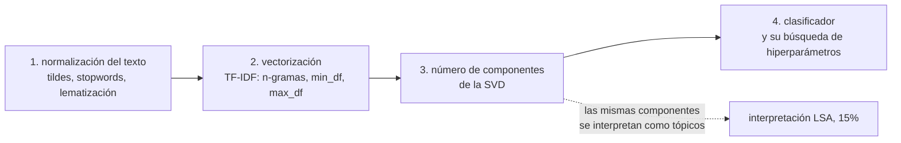

# Decisiones del método

Las decisiones del micro proyecto 2, con su argumento y su fecha de cierre. Ninguna está
cerrada todavía: el proyecto arranca el 31 de agosto de 2026 y este archivo se llena a medida
que se resuelven. El criterio de estilo es el mismo del micro proyecto 1: cada decisión vive
como parámetro con valor por defecto del estimador que la usa, y se argumenta en la sección del
notebook donde aparece.

Las cuatro decisiones grandes y cómo dependen entre sí:

La 3 es la que amarra todo: el enunciado sugiere entre 10 y 20 componentes para que los tópicos
sean interpretables, pero 20 componentes es un espacio pequeñísimo para separar 16 clases. Puede
que lo que sirve para interpretar no sea lo que sirve para clasificar, y en ese caso hay que
decidir si se usan dos descomposiciones distintas o una sola de compromiso, y justificarlo. Es
el punto donde se juega buena parte de la nota.

## 1. Normalización del texto

**Abierta.** Qué entra al vectorizador. Lo que hay que resolver:

- Palabras vacías del español. `TfidfVectorizer` no las trae; hay que aportar la lista y decir
  de dónde sale.
- Tildes: quitarlas con `strip_accents="unicode"` uniformiza al costo de fundir pares legítimos.
  Con textos traducidos automáticamente el acentuado suele ser consistente, así que la ganancia
  puede ser menor de lo que parece.
- Números: en un corpus de ODS hay años, porcentajes y metas numeradas. Quitarlos todos puede
  borrar señal (por ejemplo "2030").
- Lematización o stemming: `SnowballStemmer` en español es barato; spaCy es mejor y agrega una
  dependencia pesada al pipeline que la app de Streamlit tendría que cargar también.

## 2. Vectorización TF-IDF

**Abierta.** Rango de n-gramas, `min_df`, `max_df`, `sublinear_tf`, `max_features`. Con 9.656
documentos de mediana 105 palabras, el vocabulario en bruto queda en decenas de miles de
términos. Las decisiones aquí determinan el tamaño de la matriz que recibe la SVD.

## 3. Número de componentes de la SVD

**Abierta.** Ver arriba. Hay que medir varianza explicada acumulada y desempeño en validación
cruzada para el mismo barrido, y presentar las dos curvas: es lo que convierte la elección en
justificación y no en preferencia.

## 4. Clasificador

**Abierta.** El enunciado lo deja libre y exige justificarlo. Candidatos, con lo que aporta cada
uno:

| Candidato | A favor | En contra |
|---|---|---|
| Regresión logística | línea base fuerte sobre texto, probabilidades calibradas, rápida | lineal en el espacio proyectado |
| SVM lineal | suele ganar en clasificación de texto disperso | sin probabilidades directas, útiles para la app |
| Bosque aleatorio o gradient boosting | captura interacciones entre componentes | sobre componentes de SVD no suele pagar el costo |
| k vecinos | coherente con el espíritu del curso | sufre con la dimensión y el desbalance |

La línea base obligatoria antes de cualquier comparación: TF-IDF más regresión logística **sin
reducción**. Si la SVD no se le acerca, hay que decirlo en el notebook y explicar por qué se
aplica igual, que es lo que pide la rúbrica.

## Bitácora

**31 de agosto de 2026.** Se monta el repositorio y se perfila el corpus. Tres hallazgos que
condicionan el diseño y que ya están en `Enunciado.md`: son 16 clases y no 17, el desbalance es
de 3,5 a 1, y no hay variantes casi idénticas por la aumentación con ChatGPT (ningún par con
coseno TF-IDF mayor o igual a 0,9 sobre una muestra de 2.000). Lo último era el riesgo que
podía inflar el desempeño y queda descartado por ahora.
